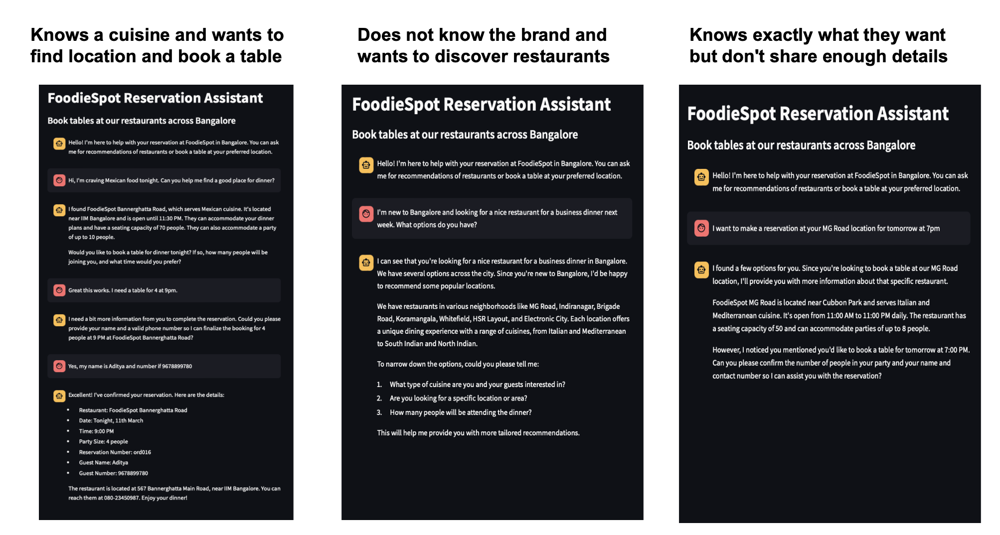

# Foodiespot Reservation System

## Project Overview
FoodieSpot Reservation System is a conversational AI solution that enables restaurant chains to automate table bookings across multiple locations. It helps customers discover restaurants based on cuisine and location preferences, then guides them through the reservation process with progressive information collection.

## Setup instructions
1. Clone the repository
2. Install requirements: pip install -r requirements.txt
3. Update restaurant_list.json with your data
4. Run python launcher.py to start both API and frontend

## Documentation of your prompt engineering approach
1. Identified core user intents through brainstorming
2. Created 30-message evaluation set and ideal conversation flows
3. Developed baseline prompt with tool definitions
4. Analyzed failure modes through testing
5. Enhanced prompt with few-shot examples for specific cases

## Example conversations showing different user journeys

## Business strategy summary
- 

## Current Technical Implementation 
- LLM Integration: Meta-Llama-3.1-8B-Instruct-Turbo via Together AI API
- Tool Calling: Enabled by Together AI API on LLM side, with FastAPI backend and RESTful endpoints
- Inline Guardrails: Checks for function call in text (e.g. "<function>...</function>)
- Frontend: Streamlit-based conversational interface
- Restaurant and Reservation Data: Managed as JSON-based files for the prototype
- Restaurant Recommendation: Key specific phrase match and ranking based Search function
- Order Management: Capacity check and Placeholder check implemented to avoid LLM hallucinations
- Launcher Script: Run with a unified launcher script with API dependency checking
- Evals and Error Handling: Evaluated over 30 samples, and error handling with appropriate HTTP status codes

## Assumptions, Limitations and Future Enhancements

### User Qualification Assumptions
- Bot designed for leads with reservation intent
- Limited spam/fraud protection implemented

Future Enhancements: As the bot is exposed to a more general audience, both inline evaluation for topic relevance and spam detection can help with increasing conversation rates through proper redirects and reducing fraudulent/junk bookings. 

### Data Model Limitations
- Simple restaurant database structure. 
- No secondary attributes (kid-friendly, parking, ambience)
- No location services or distance mapping
- Only opening and closing time time constraints. No granular slot availability.

Future Enhancements: Implement richer restaurant attributes and preference-based matching to enable personalized recommendations, and use location data to allow for bot offering to help the user from reservation to reaching. 

### Error Handling Gaps
- Basic error messaging without human handoff
- No integration with notification systems
- Missing user follow-up capabilities

Future Enhancements: Integrate live chat handoff and SMS notifications to recover abandoned conversations, as well as, collect feedback post the visit or follow-ups in case of no-shows / last minute queries. 

### Feature Scope Limitations
- New reservations only (no editing/cancellation)
- Simple keyword matching instead of semantic search
- Basic phone number validation

Future Enhancements: Build reservation management (edit/cancel) and semantic search capabilities to match industry standards, improving user retention and reducing support costs.